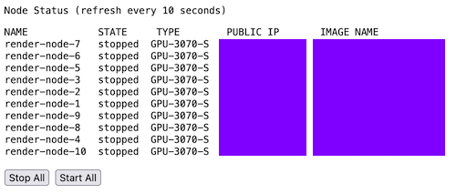

poc-mini-manager
----------------

Small demo image to start in Serverless Container to manage a fleet of instances (here with a name starting with `render-node`)

Need this env vars coming from Serverless (either namespace or container deployment):

- ACCESS_KEY: Scaleway API key with InstancesFullAccess
- SECRET_KEY: Corresponding Scaleway API secret key
- DEFAULT_ORGANIZATION_ID: Scaleway Org ID
- DEFAULT_PROJECT_ID: Scaleway Project ID
- DEFAULT_ZONE: Scaleway zone where instances are (ex: fr-par-2)
- DEFAULT_REGION: Scaleway region where instances are (ex: fr-par)
- USER: Basic auth user (default to `demo` if not provided)
- PASS: Basic auth password (default to `test` if not provided)

Container listen to port 8000, don't forget to use mandatory HTTPS connections to avoid basic auth over HTTP.

This is a very basic demo, not production ready. It leverages [Scaleway CLI](https://github.com/scaleway/scaleway-cli) to execute commands on Scaleway.

This kind of Poc demonstrates that some management of the infra could be left to a simple additional interface without access to the full console.
